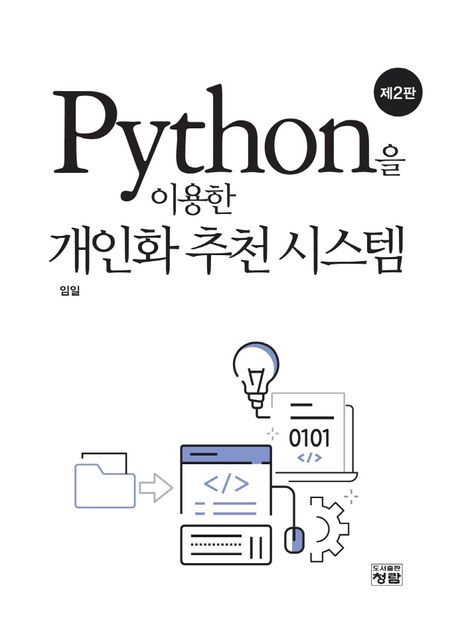

# personalized-RS
"Python을 이용한 개인화 추천 시스템 (제2판)"

- 도서: https://product.kyobobook.co.kr/detail/S000061351041
- 자료실: http://crbooks.co.kr/bbs/board.php?bo_table=4_1&wr_id=36

## Data

이 책에서 사용되는 데이터는 [MovieLens](https://grouplens.org/datasets/movielens/) 데이터로서 GroupLens라는 테스트 추천 시스템으로부터 수집된 데이터이다. GroupLens에서는 사용자가 각 영화를 1점(최악)에서 5점(최고) 사이의 점수로 평가하였다. 전체 평점의 개수는 약 2,700만 개인데, 이 책에서는 이 중에서 일부를 추출한 MovieLens 100K 데이터(Chapter 6)와 20M 데이터(Chapter 9)를 사용한다. 100K 데이터는 전체 평점 데이터 중에 100,000개(100K개)의 데이터만 추출한 것이고 20M 데이터는 2,000만 개 데이터를 추출한 데이터이다.